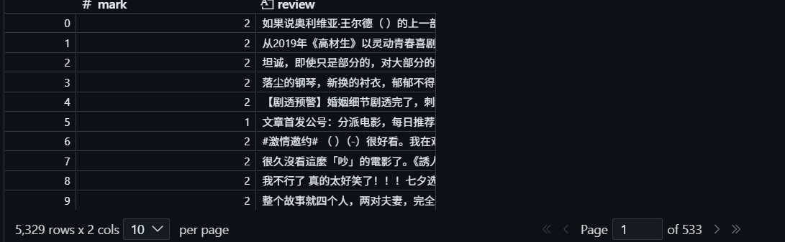

# Douban Movie Reviews Scraper

A scraper for collecting reviews of Chinese movies from the Douban (豆瓣) website, including star ratings. Implemented using Selenium as a data collection tool for a project analyzing text sentiment.

## How it works

- Starts a browser session and logs in using saved cookies
- Collects a list of movies from the page
- Navigates to the reviews section for each movie
- Iterates through the review pages, extracting text and ratings
- Cleans and filters the text (removes unnecessary content, filters out reviews that are too short)
- Saves the results to a CSV file

## Results

## Issues and Solutions

- **Anti-bot protection.** Rapid clicks and fast page navigation triggered Douban's anti-bot protection. Resolved by using `undetected-chromedriver`, introducing random delays between actions, and clicking via JavaScript to simulate more natural human behavior.
- **Full-screen consent banner.** A pop-up blocked interaction with the page upon initial load. This was resolved by explicitly waiting for the button to appear and clicking it before continuing.
- **Access is limited to 2 pages without authorization.** Full access requires logging into an account, and login is verified via SMS, which cannot be automated. This was resolved by a one-time manual login, saving browser cookies, and reusing them on subsequent runs.

## Additional Engineering Solutions

- **Resumable data collection** — the list of movies already collected is saved and loaded at each launch, so an interrupted session continues from where it left off instead of starting over from scratch.
- **Append, not overwrite** — results are appended to the CSV file rather than overwriting it, making the scraper safe to stop and restart.

## Setup

\`\`\`bash
pip install -r requirements.txt
python Douban_scraper.py
\`\`\`cd douban-scrapper
git add .
git commit -m "finalize README with results screenshot"
git push